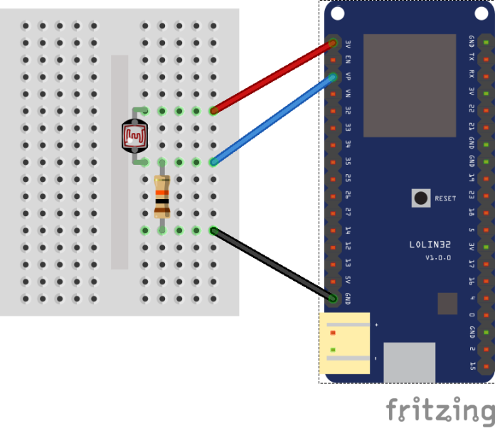

# Trabalho final PCI (Protocolos de comunicação para IoT)

O trabalho consiste em criar uma comunicação entre dois controladores utilizando 2 protocolos diferentes.

## Prototipação do cliente

O controlador cliente é conectado à um sensor LDR (Luminosidade)

## Autores

- [Bruno Sartori](https://www.github.com/brunosartori-agile)
- [Gilmar Wilian Revejes](https://github.com/wilianrevejes)

## Licença

[MIT](https://choosealicense.com/licenses/mit/)

